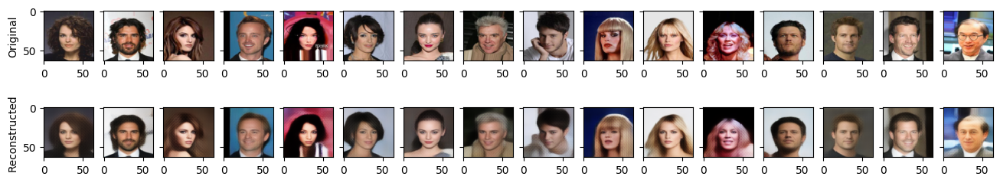
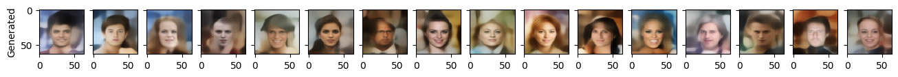

# Variational Auto Encoders with PyTorch Lightning

This repository contains code for creating and training a variational auto encoder (VAE) using [PyTorch Lightning](https://pytorch-lightning.readthedocs.io). The VAE being trained here is a *Res-Net Style VAE with an adjustable perception loss using a pre-trained vgg19*. The code for the core VAE architecture is from [this excellent repository](https://github.com/LukeDitria/CNN-VAE). The [CelebA](http://mmlab.ie.cuhk.edu.hk/projects/CelebA.html) dataset is used here for training.


## Dataset
We use an alternative Dataset class for the CelebA dataset that downloads the data from Kaggle. The version of this dataset provided in `torchvision.datasets` [(link)](https://pytorch.org/vision/stable/datasets.html#celeba) does not currently work as expected. Read more about the issue [here](https://github.com/pytorch/vision/issues/2262). The `CelebADataset` Dataset class provided in this repository is adapted from the `torchvision.datasets.CelebA` class.

To use this dataset, we use the [Kaggle API](https://github.com/Kaggle/kaggle-api). All that is needed is an API token called `kaggle.json` from Kaggle which needs to be saved in `$HOME/.kaggle/`. See [here](https://github.com/Kaggle/kaggle-api#api-credentials) for how to do this. Once the API token is present, the dataset is downloaded automatically from Kaggle.


## Training

Use `python train_vae_perceptual.py --help` to see all available flags.

To train using all available GPUs use `--gpus -1`. See [here](https://pytorch-lightning.readthedocs.io/en/stable/advanced/multi_gpu.html#select-gpu-devices) for all possible options.
```python
python train_vae_perceptual.py --seed 100 --batch_size 32 --download True --epochs 20 --lr 0.0001 --gpus -1
```

To train on CPUs use `--gpus 0`
```python
python train_vae_perceptual.py --seed 100 --batch_size 32 --download True --epochs 20 --lr 0.0001 --gpus 0
```

## Results

Reconstructed images from the validation set after training for 2 epochs:



Images generated by drawing random samples from a standard normal distribution and feeding them through the decoder:



This repository is a work in progress and the code and documentation will be updated.
